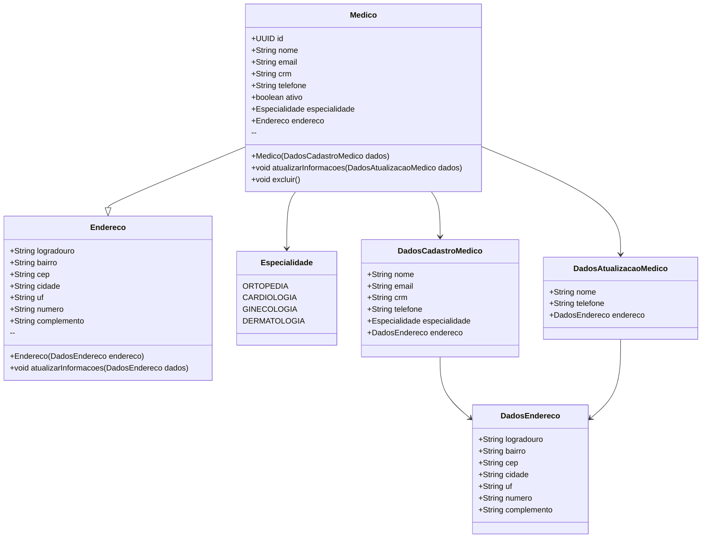

# 🩺API Voll Med - Consultas Médicas
<h1 align="center">

</h1>

Projeto de API CRUD simples utilizando Spring Boot e aplicando a metodologia do Git Flow junto ao uso do padrão de Conventional Commits e Semantic Versioning para melhor controle de versionamento e distribuição. Desenvolvido durante curso na Alura

# 🛠 Tecnologias Utilizadas
 - SpringBoot com Maven
 - Lombok
 - JPA Bean Validation

# 📃 Diagrama


## 💻 Como Rodar?

1. Clone o repositório
```bash
git clone https://github.com/Arawns1/Projeto-NekiSkills.git
```
3. Basta iniciar a aplicação normalmente, utilizando a IDE preferida.

Por padrão, a aplicação é iniciada em http://localhost:8080/
